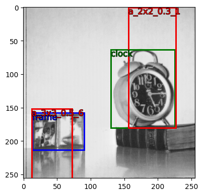

# PyBx


<!-- WARNING: THIS FILE WAS AUTOGENERATED! DO NOT EDIT! -->

[](https://badge.fury.io/py/pybx)
[](https://colab.research.google.com/github/thatgeeman/pybx/blob/master/examples/pybx_walkthrough_0.4.ipynb)
[](https://deepwiki.com/thatgeeman/pybx)

A simple python package to generate anchor boxes for multi-box and
single shot object detection models.

Calculated anchor boxes are in `pascal_voc` format by default.

### Installation

``` shell
pip install pybx
```

### Usage

To calculate the anchor boxes for a single feature size and aspect
ratio, given the image size:

``` python
from pybx import anchor, ops

image_sz = (256, 256)
feature_sz = (10, 10)
asp_ratio = 1 / 2.0

coords, labels = anchor.bx(image_sz, feature_sz, asp_ratio)
```

100 anchor boxes of `asp_ratio` 0.5 is generated along with [unique
labels](../data/README.md):

``` python
len(coords), len(labels)
```

    (100, 100)

The anchor box labels are especially useful, since they are pretty
descriptive:

``` python
coords[-1], labels[-1]
```

    ([234, 225, 252, 256], 'a_10x10_0.5_99')

To calculate anchor boxes for **multiple** feature sizes and aspect
ratios, we use `anchor.bxs` instead:

``` python
feature_szs = [(10, 10), (8, 8)]
asp_ratios = [1.0, 1 / 2.0, 2.0]

coords, labels = anchor.bxs(image_sz, feature_szs, asp_ratios)
```

All anchor boxes are returned as `ndarrays` of shape `(N,4)` where N is
the number of boxes.

The box labels are even more important now, since they help you uniquely
identify to which feature map size or aspect ratios they belong to.

``` python
coords[101], labels[101]
```

    (array([29,  0, 47, 30]), 'a_10x10_0.5_1')

``` python
coords[-1], labels[-1]
```

    (array([217, 228, 256, 251]), 'a_8x8_2.0_63')

#### [`MultiBx`](https://thatgeeman.github.io/pybx/basics.html#multibx) methods

Box coordinates (with/without labels) in any format (usually `ndarray`,
`list`, `json`, `dict`) can be instantialized as a
[`MultiBx`](https://thatgeeman.github.io/pybx/basics.html#multibx),
exposing many useful methods and attributes of
[`MultiBx`](https://thatgeeman.github.io/pybx/basics.html#multibx). For
example to calculate the area of each box iteratively:

``` python
from pybx.basics import *

# passing anchor boxes and labels from anchor.bxs()
print(coords.shape)

boxes = mbx(coords, labels)
type(boxes)
```

    (492, 4)

    pybx.basics.MultiBx

``` python
len(boxes)
```

    492

``` python
areas = [b.area for b in boxes]
```

Each annotation in the
[`MultiBx`](https://thatgeeman.github.io/pybx/basics.html#multibx)
object `boxes` is also a
[`BaseBx`](https://thatgeeman.github.io/pybx/basics.html#basebx) with
its own set of methods and properties.

``` python
boxes[-1]
```

    BaseBx(coords=[[217, 228, 256, 251]], label=['a_8x8_2.0_63'])

``` python
boxes[-1].coords, boxes[-1].label
```

    ([[217, 228, 256, 251]], ['a_8x8_2.0_63'])

[`MultiBx`](https://thatgeeman.github.io/pybx/basics.html#multibx)
objects can also be “added” which stacks them vertically to create a new
[`MultiBx`](https://thatgeeman.github.io/pybx/basics.html#multibx)
object:

``` python
boxes_true = mbx(coords_json)  # annotation as json records
len(boxes_true)
```

    2

``` python
boxes_anchor = mbx(coords_numpy)  # annotation as ndarray
len(boxes_anchor)
```

    492

``` python
boxes_true.coords
```

    [{'x_min': 130, 'y_min': 63, 'x_max': 225, 'y_max': 180, 'label': 'clock'},
     {'x_min': 13, 'y_min': 158, 'x_max': 90, 'y_max': 213, 'label': 'frame'}]

``` python
boxes_anchor.coords
```

    array([[  0,   0,  25,  25],
           [ 25,   0,  51,  25],
           [ 51,   0,  76,  25],
           ...,
           [153, 228, 198, 251],
           [185, 228, 230, 251],
           [217, 228, 256, 251]])

``` python
boxes = boxes_true + boxes_anchor
```

``` python
len(boxes)
```

    494

# Use ground truth boxes for model training

``` python
from pybx.anchor import get_gt_thresh_iou, get_gt_max_iou
from pybx.vis import VisBx
```

``` python
image_sz
```

    (256, 256)

``` python
boxes_true
```

    MultiBx(coords: 2, labels: 2)

Calculate candidate anchor boxes for many aspect ratios and scales.

``` python
feature_szs = [(10, 10), (3, 3), (2, 2)]
asp_ratios = [0.3, 1 / 2.0, 2.0]

anchors, labels = anchor.bxs(image_sz, feature_szs, asp_ratios)
```

Wrap using pybx methods. This step is not necessary but convenient.

``` python
boxes_anchor = get_bx(anchors, labels)
len(boxes_anchor)
```

    341

The following function returns two positive ground truth anchors with
largest IOU for each class in the label bounding boxes passed.

``` python
gt_anchors, gt_ious, gt_masks = get_gt_max_iou(
    true_annots=boxes_true,
    anchor_boxes=boxes_anchor,  # if plain numpy, pass anchor_boxes and anchor_labels
    update_labels=False,  # whether to replace ground truth labels with true labels
    positive_boxes=1,  # can request extra boxes
)
```

``` python
gt_anchors
```

    {'clock': BaseBx(coords=[[156, 0, 227, 180]], label=['a_2x2_0.3_1']),
     'frame': BaseBx(coords=[[12, 152, 72, 256]], label=['a_3x3_0.5_6'])}

``` python
all_gt_anchors = gt_anchors["clock"] + gt_anchors["frame"]
all_gt_anchors
```

    /work1/u31l94/pybx/pybx/basics.py:599: BxViolation: Change of object type imminent if trying to add <class 'pybx.basics.BaseBx'>+<class 'pybx.basics.BaseBx'>. Use <class 'pybx.basics.BaseBx'>+<class 'pybx.basics.BaseBx'> instead or basics.stack_bxs().
      warnings.warn(

    MultiBx(coords: 2, labels: 2)

``` python
v = VisBx(pth="../data/", img_fn="image.jpg", image_sz=image_sz)
v.show(all_gt_anchors, color={"a_2x2_0.3_1": "red", "a_3x3_0.5_6": "red"})
```



More exploratory stuff in the [walkthrough
notebook](https://github.com/thatgeeman/pybx/blob/master/examples/pybx_walkthrough_0.4.ipynb)
or [](https://colab.research.google.com/github/thatgeeman/pybx/blob/master/examples/pybx_walkthrough_0.4.ipynb)
