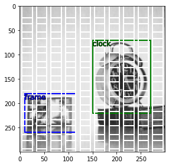

# PyBx
[](https://badge.fury.io/py/pybx)
[](https://colab.research.google.com/github/thatgeeman/pybx/blob/master/nbs/pybx_walkthrough.ipynb)

A simple python package to generate anchor boxes for multi-box 
object detection models. Calculated anchor boxes are in `pascal_voc` format by default.

### Installation
```shell
pip install pybx
```

### Usage

To calculate the anchor boxes for a single feature size and 
aspect ratio, given the image size: 
```python
from pybx import anchor

image_sz = (300, 300, 3)
feature_sz = (10, 10)
asp_ratio = 1/2.

coords, labels = anchor.bx(image_sz, feature_sz, asp_ratio)
```

To calculate anchor boxes for **multiple** feature sizes and 
aspect ratios:
```python
feature_szs = [(10, 10), (8, 8)]
asp_ratios = [1., 1/2., 2.]

coords, labels = anchor.bxs(image_sz, feature_szs, asp_ratios)
```
All anchor boxes are returned as `ndarrays` of shape `(N,4)` where N
is the number of boxes; along with a list of 
[default labels](data/README.md) for each box. 

### Using `MultiBx` methods
Box annotations in any format (`ndarray`, `list`, `json`, `dict`) 
can be instantialized as a `MultiBx`, exposing many useful 
methods and attributes `MultiBx`. 
For example to calculate the area of each box iteratively:
```python
from pybx.basics import * 
# passing anchor boxes and labels from anchor.bxs()
boxes = mbx(coords, labels)  
areas = [b.area() for b in boxes]
```
Each annotation in the `MultiBx` object `boxes` is a 
`BaseBx` with its own set of methods and properties. 

`MultiBx` objects can also be "added" which stacks 
them vertically to create a new `MultiBx` object:
```python
boxes_true = mbx(coords_json)    # annotation as json records
boxes_anchor = mbx(coords_numpy) # annotation as ndarray
boxes = boxes_true + boxes_anchor
```

The `vis` module of `pybx` can be used to visualize these "stacks"
of `MultiBx` objects, raw `ndarray`/`list`/`json` records, 
target annotations and model logits.



Please refer 
to [Visualising anchor boxes](data/README.md) or try out the 
[walkthrough notebook](nbs/pybx_walkthrough.ipynb) for more 
details!
