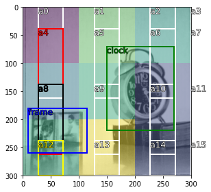

## Visualisation
<a href="https://colab.research.google.com/github/thatgeeman/pybx/blob/master/nbs/pybx_walkthrough.ipynb" target="_parent"></a>

To display the calculated boxes, simply pass `show=True` to `anchor.bx`:
```python
anchor.bx(image_sz, feature_sz, asp_ratio, show=True)
```


The boxes in white with label `unk` are the anchor boxes. 
We can hightlight them with a different color if needed.
```python
anchor.bx(image_sz, feature_sz, asp_ratio, show=True, 
          color={'unk':'red'})
```


We can also overlay the features/receptive fields on the original 
image (only for reference and visualisation). 
`logits=True` simply generates numbers of the same shape as feature 
sizes for illustration purposes.

```python
anchors = anchor.bx(image_sz, feature_sz, asp_ratio, 
                    show=True, color={'unk':'red'}, 
                    logits=True)
```
 


## Customizing visualisation behaviour

To display the anchor boxes overlayed on top of a custom image, 
pass additional args `show=True, pth=PATH, 
img_fn=IMAGE, ann_fn=ANNS`. 
The parameter `img_fn` expects an image file name stored in disk at the provided `PATH`. 
Similarly, the parameter `ann_fn` expects the annotation file name in json format ([see example](annots.json)) at 
`PATH`.
This is what happens internally when `anchor.bx()` method gets `show=True` along with the image and annotation paths. 

### Get sample image
Loading a sample image with randomly generated [logits](https://en.wikipedia.org/wiki/Logit) and generated anchors for the requested image and feature size.
```python3
from pybx import vis

im_array, annots, logits, color = vis.get_example(image_sz, feature_sz)  
# pth='.', img_fn='image.jpg', ann_fn='annots.json'
```
### Display image
Displaying image with annotations, anchor boxes over logits
```python3
vis.draw(im_array, anchors.tolist() + annots, logits=logits, color=color)
```

### Making it colorful
`color` can take a Dict of colors to highlight specific labels in the image. 
In this case, by default unspecified labels will be shown in white.
```python3
c={'frame':'blue', 
   'clock':'green', 
   'a4':'red', 'a12': 'yellow', 'a8': 'black'} # a4: anchor box 4, and so on

vis.draw(im_array, anchors.tolist() + annots, color=c, logits=logits)
```



## Notes on test image
Image obtained from USC-SIPI Image Database using:
```bash
! wget -q -O 'image.jpg' 'https://sipi.usc.edu/database/download.php?vol=misc&img=5.1.12'
```
### USC-SIPI Image Database
The USC-SIPI image database is a collection of digitized images. 
It is maintained primarily to support research in image processing, 
image analysis, and machine vision. The first edition of the 
USC-SIPI image database was distributed in 1977 and many new 
images have been added since then.

For free to use images, and further copyright information about 
the image used in this project, please check:
- [The copyright information](https://sipi.usc.edu/database/copyright.php)
- [The full image database](https://sipi.usc.edu/database/database.php)