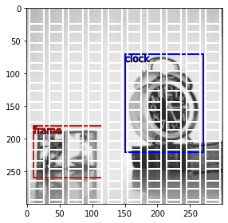

## Visualisation
[](https://colab.research.google.com/github/thatgeeman/pybx/blob/master/nbs/pybx_walkthrough.ipynb)

To display the calculated anchor boxes use `vis.VisBx`.
`vis.VisBx()` initializes all the params for plot and loads the 
image and target annotations.
The `show()` method can be called on `VisBx()` to display everythin. 
`show()` takes the calculated coords as an `ndarray`/`json`/`list` or any 
of the encoded `Types`: `JsonBx`, `ListBx`. 
During visualisation, all boxes and labels are converted to 
the `MultiBx` 
type, exposing many useful methods and attributes
of each anchor box. 
```python
from pybx import anchor, vis

image_sz = (300, 300, 3)
feature_sz = (10, 10)
asp_ratio = 1/2.

coords = anchor.bx(image_sz, feature_sz, asp_ratio, named=False)
v = vis.VisBx(image_sz)
v.show(coords, color={'clock':'red'})
```


The boxes in white are the calculated anchor boxes. 
We can hightlight them with a different color if needed. Anchor boxes 
generated with `named=True` parameter automatically sets the label
for each box in the format: `{anchor_sfx}_{feature_sz}_{asp_ratio}_{box_number}`. 
`anchor_sfx` is also an optional parameter that can be passed to `anchor.bx()`. 
In the below example 
we modify the color for the box with label `a_2x2_0.3_3`. The 
default label can always be overridden provided the 
number of boxes and labels match.
```python
from pybx import anchor, vis

image_sz = (300, 300, 3)
feature_sz = (2, 2)
asp_ratio = 0.3

coords, labels = anchor.bx(image_sz, feature_sz, asp_ratio)
v = vis.VisBx(image_sz)
v.show(coords, labels, color={'a_2x2_0.3_3': 'red'})
```


We can also overlay the features generated by the model on the 
original 
image. `logits=True` generates random logits (`np.random.randn`)
of the same shape as feature 
sizes for illustration purposes. To aid the explainability of the 
model, actual model logits can also be 
passed into the same parameter
as an array or detached tensor. 

```python
from pybx import anchor, vis

image_sz = (300, 300, 3)
feature_sz = (2, 2)
asp_ratio = 0.3

coords, labels = anchor.bx(image_sz, feature_sz, asp_ratio, named=True)
v = vis.VisBx(image_sz, feature_sz=feature_sz, logits=logits)
v.show(coords, labels)
```
 


## Customizing visualisation behaviour

To display the anchor boxes overlayed on top of a custom image, 
pass additional args `pth=PATH, 
img_fn=IMAGE, ann_fn=ANNS` to `vis.VisBx` during initialisation. 
The parameter `img_fn` expects an image file name stored in disk at the provided `PATH`. 
Similarly, the parameter `ann_fn` expects the annotation file name in json format ([see example](annots.json)) at 
`PATH`.

## Notes on test image
Image obtained from USC-SIPI Image Database using:
```bash
! wget -q -O 'image.jpg' 'https://sipi.usc.edu/database/download.php?vol=misc&img=5.1.12'
```
### USC-SIPI Image Database
The USC-SIPI image database is a collection of digitized images. 
It is maintained primarily to support research in image processing, 
image analysis, and machine vision. The first edition of the 
USC-SIPI image database was distributed in 1977 and many new 
images have been added since then.

For free to use images, and further copyright information about 
the image used in this project, please check:
- [The copyright information](https://sipi.usc.edu/database/copyright.php)
- [The full image database](https://sipi.usc.edu/database/database.php)