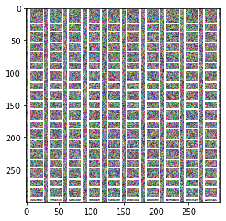

## Visualization
[](https://colab.research.google.com/github/thatgeeman/pybx/blob/master/nbs/pybx_walkthrough.ipynb)

To display the calculated anchor boxes or any other type of bounding
boxes, `pybx` offers the `vis.VisBx` class.
First, `vis.VisBx` initializes all the params for the image
and loads its annotations (if available).
Upon calling the `show()` method on the instantiated 
`VisBx` object with our 
predicted annotations or anchor boxes, everything 
gets displayed.

### Loading from disk
```python
from pybx import anchor, vis

image_sz = (300, 300, 3)
feature_sz = (10, 10)
asp_ratio = 1/2.

coords = anchor.bx(image_sz, feature_sz, asp_ratio, named=False)
v = vis.VisBx(image_sz=image_sz, sample=True)
v.show(coords, color={'frame':'blue'})
```


To load image and annotation data from disk, set `sample=True`. 
In the above example, `VisBx(sample=True)` loads the 
[image](image.jpg) and its
[annotations](annots.json) from disk. 
By default, `VisBx()` looks inside the current directory for
`img_fn='image.jpg'` and `ann_fn='annots.json'`. This can be changed
by passing the correct file names and path `pth` argument. 
If annotations for 
the image are not availabe or are not required, set 
`load_ann=False`. 
The `blue` and `green` frames are the 
[provided image annotations](annots.json).
 `image_sz` is the size
to which the image should be resized. This, in combination with
`load_ann=True`, the image
bounding boxes will be scaled to the new size.

### Display image array (default behaviour)

To display an image array (shape of `W, H, C`) directly, instead of 
loading from disk, pass an `ndarray`
to the `image_arr` argument. If available, also provide the
`annots` in any 
[supported format](#customizing-visbx-behaviour).

```python
v = vis.VisBx(image_arr=image_arr, annots=annots)
v.show(coords, color={'frame':'red', 'clock':'blue'})
```


If no arguments are passed to `VisBx`, it uses random
noise as `image_arr` to display the bounding boxes.
```python
v = vis.VisBx().show(coords)
```


### Customizing VisBx behaviour

The `show()` method takes the predicted coords or anchor boxes
as an `ndarray`/`json`/`list` or any of the internal types: 
`MultiBx`, `BaseBx`, `JsonBx`, `ListBx`. It then plots these 
boxes on the same axes. 

As illustrated in the above examples, `color` is a `dict` that
sets the color of the annotations. This can be also applied to 
named anchor boxes. Anchor boxes 
generated with `named=True` parameter automatically sets 
the label
for each box in the format: 
`{anchor_sfx}_{feature_sz}_{asp_ratio}_{box_number}`. 
`anchor_sfx` is also an optional argument that can be 
passed to `anchor.bx()` or `anchor.bxs()`. 
In the below example 
we modify the color for the box with label `a_2x2_0.5_3`. The 
default label can always be overridden provided the 
number of boxes and labels match.
```python
feature_sz = (2, 2)
asp_ratio = 1/2

coords, labels = anchor.bx(image_sz, feature_sz, asp_ratio)

v = vis.VisBx(image_arr=image_arr, annots=annots)
v.show(coords, labels, color={'a_2x2_0.5_3': 'red', 'frame': 'green', 'clock': 'green'})
```


To aid the explainability of the 
model, actual model `logits` can also be 
passed into `logits` as an array or detached tensor. 
Instead, if is lazily set `logits=True`, `VisBx` 
generates random logits
of the same shape as feature 
size for illustration purposes. 

```python
v = vis.VisBx(image_arr=image_arr, annots=annots, 
              feature_sz=feature_sz, logits=True)

v.show(coords, labels, color={'a_2x2_0.5_3': 'red', 'frame': 'green', 'clock': 'green'})
```


There's lots more stuff that can be customized for 
`VisBx` and `show`, do checkout the docstrings `help(v)` 
and `help(v.show)`!

[](https://colab.research.google.com/github/thatgeeman/pybx/blob/master/nbs/pybx_walkthrough.ipynb)